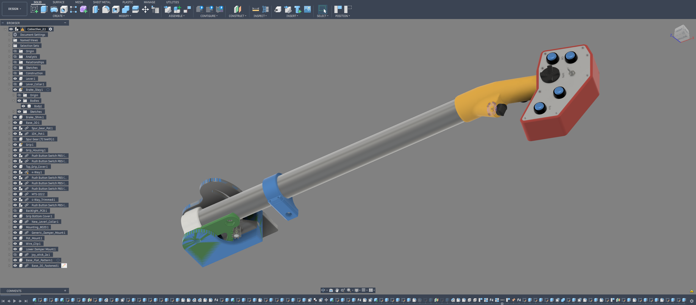

# Collective_Files

## THIS IS ABANDONWARE!

### This project is currently not documented well enough for people tackling their first Arduino project. 
I encourage the community to submit PRs to increase the quality of the documentation so the project is available to a broader audience.

I'm sharing these for anyone who would like to experiment with their own build. I haven't pursued this further myself due to professional commitments. If you have any questions I will make an attempt to help but please have low expectations: my time is extremely limited

This was designed in Autodesk Fusion a few years back as a personal project. [Collective_2.1.f3z](Collective_2.1.f3z) is the main assembly. There are a ton of deprecated components in this assembly representing lots of build options and variations. 

### Processes
Most parts are FDM 3D printed. For the trim hats, I wound up resin printing for detail but these have been brittle in practice. I wound up using long M2 screws threaded through the center of the large hat as a reinforcement. The face plate on the grip is white acrylic that was painted black and then laser etched. Tha back plate of the grip was also made from acrylic. I planned to backlight the markings but never got to it. Eventually I machined an aluminum side plate for mounting everything - the manufacture workspace in Fusion should show the toolpaths, etc.

### BOM 
Non-affiliate links
- 12mm push buttons: [https://a.co/d/09tn9fx9](https://a.co/d/09tn9fx9)
- Tactile buttons in hat switches: [https://a.co/d/0gzKXzKI](https://a.co/d/0gzKXzKI)
- Toggle switches: [https://a.co/d/0j6KnOrc](https://a.co/d/0j6KnOrc)
- Potentiometer (Any "B10K" on amazon will likely work) [https://a.co/d/03IGPmhE](https://a.co/d/03IGPmhE)
- MCP23017 I/O expander - I wound up spinning my own board. I'd recommend using Adafruit's pre-built version: [https://www.adafruit.com/product/5346?gad_source=1&gad_campaignid=21079227318&gbraid=0AAAAADx9JvT0hwd9MZeEboB6OtWVK-04O&gclid=CjwKCAjwu53SBhAhEiwAJzSLNmEfZ82HP4vLyviFUn7yBKgNMheWr3lMW1ML75dkX3W3pOIZm_DKdRoCw9oQAvD_BwE](https://www.adafruit.com/product/5346?gad_source=1&gad_campaignid=21079227318&gbraid=0AAAAADx9JvT0hwd9MZeEboB6OtWVK-04O&gclid=CjwKCAjwu53SBhAhEiwAJzSLNmEfZ82HP4vLyviFUn7yBKgNMheWr3lMW1ML75dkX3W3pOIZm_DKdRoCw9oQAvD_BwE)
- Main friction control: IIRC, this is a long 1/4-20 bolt and knob from the local hardware store. I wound up adding brass washers to slide against the aluminum mount and a rubber washer to give a bit more ease of adjustment
- Aluminum Tube - This was designed around 1.25" diameter aluminum tube. I usded 0.125" thick wall for stiffness and heft
- Arduino: I wound up using an Arduino Pro Micro. The code is setup for a Atmega32u4 chipset
- Connectors - I added a connector disconnect at the grip [https://a.co/d/0e0zYBjw](https://a.co/d/0e0zYBjw)

### Code Notes
A0 is intended to be the input from the Potentiometer.
I used Pin 6 to power the MCP so it would be reinitialized/power cycled (with limited success)
I don't remember what pin the MCP23017 I2C connects to offhand. There should be online examples of using the MCP23017. Please feel free to submit a PR to update this note in the future for the benefit of others

### Calibration
For calibration, I would uncomment line 100 (Serial.println(analogIn)) and adjust the pot and gear alignment to make sure I wasn't "bottoming out" at either the top or bottom of travel. At the top and bottom of travel, I'd note the raw values, and I'd input these (maybe with some offset?) into line 19 ( Joystick.setThrottleRange(70, 1024);) - in this example 70 is the min value and 1024 is the max.

### Testing
I was able to use the standard Windows "Setup USB Game Controllers" interface. The Collective showed up as an Arduino and you should be able to click each button and see on of the red circles light up.

### Build Notes
I wound up adding a wire that goes from the body of the aluminum tube to the body of the Arduino USB connector to manage electrostatic discharge. Otherwise, the only way ESD can get from the grip to ground is through the wiring of the MCP23017

I added a small M2 screw to one of the buttons on the underside of the grip so they felt more physically distinct. I was able to thread it straight into the button cap after making a very small hole

### Wiring
I recommend adding a connector between the grip and the stick for quick disconnect. I wound up using what looks like a 4 pin servo connector made out of 0.1" pitch DuPont style headers from the BOM. The buttons on the MCP23017 are all setup so that one leg goes to an input and the other goes to ground. It looks like the Adafruit board is nicely setup for this.

### buymeacoffee
If you appreciate this project and would like to tip: [buymeacoffee.com/fat.lurch](buymeacoffee.com/fat.lurch)

